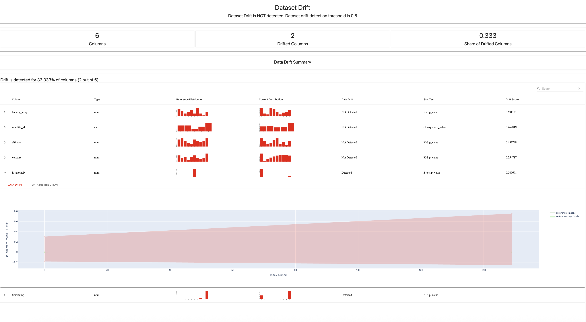

# Satellite Telemetry & Anomaly Detection Pipeline

> An end-to-end MLOps and data engineering pipeline that ingests, processes, and monitors streaming satellite telemetry using Apache Kafka, PySpark Structured Streaming, FastAPI, and Unsupervised Machine Learning.

---

## What It Does

This project simulates a satellite ground station telemetry system. It doesn't just move data — it uses an **Isolation Forest** model to detect orbital anomalies in real-time.

A producer streams telemetry (altitude, velocity, battery temperature) into Kafka. A PySpark Structured Streaming job consumes these events, calls a FastAPI-based inference microservice for anomaly detection, and sinks the results into both a PostgreSQL database and a Parquet data lake. Finally, **Evidently AI** performs statistical drift analysis to ensure the model stays reliable over time.

---

## Architecture

```
Telemetry Producer (Python)
        │
        ▼
   Apache Kafka (Topic: satellite_telemetry)
        │
        ▼
PySpark Structured Streaming
        │
        ├── ML Inference Call ──▶ FastAPI Service (Isolation Forest)
        │
        └── foreachBatch Sink
                ├── PostgreSQL (telemetry_db)  ◀── Grafana Visualization
                └── Parquet Data Lake (Historical Analysis & Drift Monitoring)
```

---

## Stack

| Layer | Technology |
|---|---|
| **Message Broker** | Apache Kafka + Zookeeper (Confluent 7.5) |
| **Stream Processing** | PySpark 4.0 Structured Streaming |
| **Machine Learning** | Scikit-Learn (Isolation Forest), Joblib |
| **Model Serving** | FastAPI, Uvicorn |
| **Monitoring** | Evidently AI (Data & Target Drift) |
| **Storage** | PostgreSQL 15, Parquet Data Lake |
| **Orchestration** | Docker Compose |

---

## Key Features

- **Real-time ML Inference** — Spark processes micro-batches and requests anomaly predictions from a containerized FastAPI microservice, decoupled from the processing layer so each can scale independently.
- **Unsupervised Anomaly Detection** — Uses an Isolation Forest trained on historical telemetry to identify outliers — things like solar flare temperature spikes that no labeled dataset could anticipate.
- **Model Monitoring & Drift Detection** — Integrated Evidently AI reports use the Kolmogorov-Smirnov test to identify when telemetry distributions shift away from the training baseline, flagging when the model may need retraining.
- **Dual-Sink Architecture** — Processed data lands in Postgres for live dashboarding and Parquet for long-term storage and retraining pipelines.
- **Fully Containerized** — The entire infrastructure (Kafka, Postgres, Grafana, Inference Service) is orchestrated via Docker Compose, making it deployable on any machine or cloud environment identically.

---

## Evidently AI Drift Report

The screenshot below shows a real output from the drift monitoring system after simulating a "Solar Flare" event. 2 out of 6 columns showed statistically significant drift — `is_anomaly` (Z-test p-value: 0.049) and `timestamp` — while core telemetry features like altitude, velocity, and battery temperature held stable. This is exactly the kind of output a production ML team would review before deciding whether to retrain.



---

## Project Structure

```
satellite-pipeline/
├── src/
│   ├── producer.py           # Kafka producer — simulates satellite telemetry
│   ├── spark_stream.py       # PySpark job — processes stream & calls ML service
│   ├── train_model.py        # ML training script — generates anomaly_model.pkl
│   └── inference_service.py  # FastAPI microservice for real-time predictions
├── infra/
│   ├── docker-compose.yml    # Kafka, Postgres, Grafana, & service definitions
│   └── Dockerfile.inference  # Container environment for the ML microservice
├── generate_report.py        # Monitoring script — generates Evidently AI reports
├── requirements.txt          # Project dependencies
├── data_lake/                # Local Parquet storage (gitignored)
└── models/                   # Saved ML models (gitignored)
```

---

## Getting Started

### 1. Start the Infrastructure

```bash
docker-compose -f infra/docker-compose.yml up -d
```

This launches Kafka, Zookeeper, Postgres, Grafana, and the FastAPI Inference Service on a shared Docker network.

### 2. Train the Model (Optional)

If you have baseline data in `data_lake/`, generate a fresh Isolation Forest model:

```bash
python src/train_model.py
```

### 3. Run the Pipeline

Open two terminal windows and run these in order:

```bash
python src/spark_stream.py   # Start the PySpark processing engine
python src/producer.py       # Start the telemetry stream
```

### 4. Monitor Data Drift

After running a simulation (e.g., a solar flare event), generate a statistical drift report:

```bash
python generate_report.py
```

Open `satellite_drift_report.html` in your browser to view the full analysis.

---

## Telemetry Schema

| Field | Type | Description |
|---|---|---|
| `satellite_id` | string | Identifier (SAT-1 through SAT-5) |
| `altitude` | float | Orbital altitude in km |
| `velocity` | float | Orbital velocity in km/s |
| `battery_temp` | float | Battery temperature in °C |
| `is_anomaly` | int | 1 if flagged by ML model, else 0 |
| `ingestion_time` | timestamp | Processing time in Spark |

---

## MLOps Notes

**Why Isolation Forest?** In real-world telemetry systems, you rarely have labeled data telling you "this reading is an anomaly." Isolation Forest is an unsupervised algorithm that learns what "normal" looks like and flags deviations — no labels required.

**Why decouple the inference service from Spark?** Embedding the model directly in the Spark job would mean redeploying the entire pipeline every time you retrain. By serving it through FastAPI, you can swap the model out with zero downtime to the data layer.

**Why dual-sink?** Postgres gives you sub-second query access for live dashboards and Grafana alerts. Parquet gives you a compressed, columnar archive that's efficient to scan for retraining and batch analysis — two different use cases that need two different storage formats.

---

## What I Learned Building This

A few things that weren't obvious going in:

- **Docker networking is not localhost.** Services inside a Docker network can't reach each other via `localhost` — they need to reference each other by container name. Figuring out why Spark couldn't reach the FastAPI service pushed me to actually understand how container networking works.
- **Checkpointing is what makes streaming reliable.** Spark's checkpoint directory tracks exactly where in the Kafka offset the job left off. Without it, a crash means you either reprocess everything or lose events. It's a small config option with a big operational impact.
- **Drift and anomaly are not the same thing.** A single temperature spike is a point anomaly — the Isolation Forest catches that. A solar flare shifting the *entire distribution* of readings is dataset drift — that's what Evidently catches. Both matter, and they require different tools.

---

## Skills Demonstrated

- **Distributed Systems** — Event-driven architecture with Apache Kafka for high-throughput data ingestion
- **Streaming Analytics** — PySpark Structured Streaming with micro-batch processing, windowing, and fault-tolerant checkpointing
- **Microservice Architecture** — Decoupled ML inference layer served via FastAPI, independently scalable from the data pipeline
- **Unsupervised Machine Learning** — Isolation Forest for anomaly detection without labeled training data
- **MLOps & Model Monitoring** — Statistical drift detection using Evidently AI and the Kolmogorov-Smirnov test
- **DevOps & Containerization** — Full infrastructure-as-code with Docker Compose; reproducible across any environment
